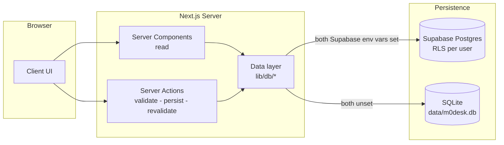

# M0Desk

A personal command center — projects, tasks, knowledge, library and inbox in
one quiet place. Each signed-in account gets an independent private workspace.

Opens straight into a dashboard. Every account gets its own private space,
fully isolated by row-level security. Runs locally on SQLite with zero
setup, or on Vercel + Supabase for access anywhere.

## Features

- **Today** — what to focus on right now: tasks due today/overdue, project
  deadlines (next 14 days, urgent ones highlighted), active projects with
  current stage & next action, and a live inbox preview.
- **Projects** — status filter (Active / Paused / Completed / Archived),
  priority, deadline, goal, current stage, next action, notes, and its tasks.
- **Tasks** — clean list, sorted by due date, filters by status / project /
  priority, one-click complete, overdue highlighting.
- **Knowledge** — distilled understanding with Markdown notes, category, tags,
  status (Learning / Understood / Review), search.
- **Library** — raw material: papers, repos, courses, videos… with type/status
  tags and open-in-new-tab links.
- **Inbox** — the entry point. Capture anything in 5 seconds; convert captures
  into a Task, Project, Knowledge or Library item in one click.
- **Global search** — `Ctrl/Cmd + K` searches everything at once, grouped by
  type. `Ctrl/Cmd + N` captures a thought anywhere.
- **Dark / Light / System** theme. Delete confirmations, toasts, empty states,
  mobile drawer — the details are handled.

## Tech highlights

- **Dual backend, one codebase** — equivalent data operations run against
  Supabase (Postgres + RLS) when both Supabase environment variables are set,
  and against a
  zero-dependency local SQLite file (`node:sqlite`) otherwise. Swapping the
  persistence layer requires no code changes.
- **Multi-user isolation by design** — every row carries `user_id`; Row Level
  Security policies enforce row ownership and same-user project references at
  the database, not the frontend. Sign in as a second account and you see an
  empty workspace.
- **Server-first architecture** — Server Components render, Server Actions
  write (validate → persist → revalidate), the UI never touches the database.
- **46 integration tests** on the data layer, actions and local request
  boundary (vitest), running in CI on pushes to `main`/`master` and on pull
  requests.
- **No `any`, no framework fights** — strict TypeScript, plain SQL, zero
  over-engineering.

## Architecture



## Stack

- [Next.js](https://nextjs.org) 16 (App Router, Server Components, Server Actions)
- TypeScript (strict)
- Tailwind CSS v4 + [shadcn/ui](https://ui.shadcn.com) (radix-nova, dark-first)
- [Supabase](https://supabase.com) (Postgres, Auth, RLS) — cloud backend
- SQLite via Node's built-in `node:sqlite` — local backend, zero deps
- [Vitest](https://vitest.dev) — integration tests
- GitHub Actions — CI (lint, typecheck, test, build)

## Quick start (local)

Requires Node.js **>= 22.5** (built-in `node:sqlite`; developed on Node 24).

```bash
# 1. install dependencies
npm install

# 2. run the dev server
npm run dev
# open http://localhost:3000

# 3. (optional) load example data — only when the database is empty
npm run seed
```

No env files, accounts or external services are required — the request
boundary and data layer both fall back to a local SQLite file automatically.
To use the Supabase backend instead, copy `.env.example` to `.env.local` and
fill in both Supabase values. Setting only one value is rejected as an invalid
configuration.

## Testing

```bash
npm test          # 46 integration tests against throwaway SQLite databases
npm run check:secrets
```

Tests cover the full local data lifecycle per entity, foreign-key behavior,
atomic inbox conversion, the local request boundary, the Today dashboard
queries and global search (including LIKE-wildcard escaping and tag shape).
Each data test starts from a clean database. Supabase RLS still requires the
two-account deployment check below; the local test suite does not claim to
execute against the cloud project.

## Where your data lives

- Local mode: `data/m0desk.db` (auto-created on first run, gitignored)
- Cloud mode: Supabase Postgres, one table per entity, RLS-scoped per user
- Schema: `src/lib/db/schema.sql` (SQLite) · `supabase/migrations/` (Postgres)
- **Export**: Settings → Data → *Export backup (JSON)* downloads a consistent
  JSON snapshot or fails explicitly. Keep it somewhere safe. An automated
  import/restore command is not implemented yet.

## Deploy to Vercel (Supabase backend)

### One-time setup

1. **Supabase project** — create one at supabase.com, then in its **SQL
   Editor** run these files in order:

   1. `supabase/migrations/0001_init.sql`
   2. `supabase/migrations/0002_multi_user_hardening.sql`

   For an existing M0Desk database that already has `0001`, run only `0002`.
2. **Vercel project** — link this folder:

   ```bash
   npx vercel link --yes
   ```

3. **Environment variables** (Production) — values from Supabase Dashboard →
   Project Settings → API:

   ```bash
   echo "<project url>"       | npx vercel env add NEXT_PUBLIC_SUPABASE_URL production
   echo "<publishable key>"   | npx vercel env add NEXT_PUBLIC_SUPABASE_PUBLISHABLE_KEY production
   echo "https://<project>.vercel.app" | npx vercel env add NEXT_PUBLIC_APP_URL production
   ```

4. **Deploy**:

   ```bash
   npx vercel --prod
   ```

5. **Choose the sign-up policy** — in Supabase Dashboard → Authentication →
   Providers → Email, decide whether new accounts must confirm their email.
   M0Desk supports both modes: with confirmation enabled it asks the user to
   check their email; with confirmation disabled it signs them in immediately.
6. **Create an account** — open the deployed URL and use *Create account*.
   Every account gets its own RLS-isolated data space.

### Verify the deployment

- Open the produced `https://<project>.vercel.app` — you see the sign-in
  page. Sign in (or create an account) and you land on `/today`.
- Create a task / capture an inbox item → reload → it's still there.
- Sign out (user menu, bottom of the sidebar) and sign in as a second
  account — that account sees an empty workspace, never your data.
- With account B, attempt to use an account-A project ID when creating a task,
  knowledge entry or library item; the write must be rejected.
- Convert one inbox item twice; only one target row should exist.
- Settings → Data shows real item counts; *Export backup (JSON)* downloads
  everything.

### Updating the app later

```bash
npx vercel --prod   # after any code change
```

## Scripts

| Command            | What it does                                 |
| ------------------ | -------------------------------------------- |
| `npm run dev`      | Start the dev server                         |
| `npm run build`    | Production build                             |
| `npm run start`    | Serve the production build                   |
| `npm run lint`     | ESLint                                       |
| `npm run test`     | Vitest integration tests                     |
| `npm run check:secrets` | Scan tracked files for common secrets  |
| `npm run seed`     | Insert example data into an empty database   |
| `npx tsc --noEmit` | TypeScript check                             |

## Project structure

```
src/
  app/                  # routes: today, projects, tasks, knowledge,
                        # library, inbox, secretary, settings, api/export
  components/           # layout shell, per-entity UI, shared bits
  lib/
    db/                 # data access layer (SQLite + Supabase branches)
    actions/            # server actions (all writes go through here)
    supabase/           # auth-aware server/browser clients
tests/                  # integration tests (vitest)
data/m0desk.db          # local data (created at runtime)
scripts/seed.mjs        # dev seed
scripts/check-secrets.mjs
src/proxy.ts            # local bypass + Supabase session boundary
supabase/migrations/    # ordered Postgres schema and hardening migrations
.github/workflows/ci.yml
```

Data access is centralized in `src/lib/db/`; all mutations go through Server
Actions in `src/lib/actions/`. UI components never touch the database
directly. The persistence backend is chosen once in `src/lib/db/backend.ts`.

## FAQ

**Is my data private?** Local mode: it lives in a file on your machine,
nothing is sent anywhere. Cloud mode: every account is isolated by row-level
security — nobody can read or write another account's rows.

**Why SQLite *and* Supabase?** Local-first means zero setup, zero accounts
and full offline control; the Supabase backend supports multiple isolated
accounts and access from any device. Same code, two paired public environment
variables.

**Can I use it on two machines?** In cloud mode, yes — data is in Supabase.
In local mode, not synchronised (by design). You can export a JSON snapshot,
but automated restore/import is not implemented yet.

## License

MIT
